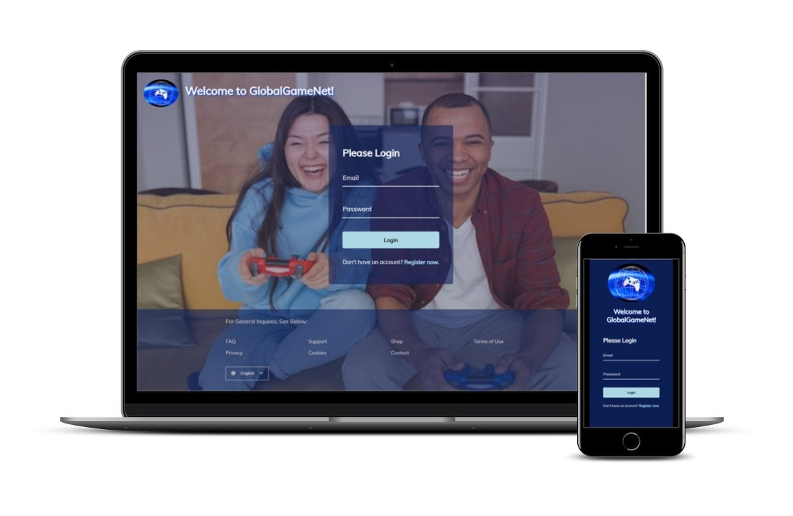

# GlobalGameNet Login Page

This is a modification to the [Form Wave Animation project (Day 8) in the Udemy course 50 projects in 50 Days](https://www.udemy.com/course/50-projects-50-days/?src=sac&kw=50+projects+50+days).

## Project Details

The goal of the initial project was to create a login form that displays wave animation when selecting an input field. I wanted to utilize this project code on a login page for a global gaming company and style it to mimic the Netflix sign in page. To accomplish this, I had to:

- Create a company name and logo.
- Add a header and footer to the page.
- Enable language translation with the selected language button.

### View My Project: 

## Features

- Login form inputs display wave animation when clicked.
- Page translates to the language of choice.
- Layout is responsive to screen size.

## Technologies Used

- HTML5
- CSS3
- JavaScript

## My Process

- Start the files from a boiler template.
- Add a header and footer with links.
- Create a company name and design a logo.
- Add initial styles to the page.
- Add a language selector button in the footer.
- Create functions for the footer button to display the language options menu when clicked(toggled) and close the options menu when the user clicks elsewhere on the page.
- Update the HTML and JS files to enable language translation when the user selects their language of choice.
- Fix the issue with the footer links that arose when coding for language translation.
- Create a CSS custom variable for the borders, text, and icons in the footer.
- Validate HTML and CSS code.

### Continued development

This was the first time I have attempted to code a page with the language selection option. I wanted to achieve this goal with javascript only and not rely on other sources to translate the page as the page content was minimal. I enjoyed the challenge and will likely investigate this further to utilize this concept in future projects.

## Acknowledgements

Original Project idea: Brad Traversy, Florin Pop [Udemy course 50 Projects in 50 Days](https://www.udemy.com/course/50-projects-50-days/?src=sac&kw=50+projects+50+days)

Original HTML, CSS & Javascript provided by: Brad Traversy, Florin Pop [Udemy course 50 Projects in 50 Days](https://www.udemy.com/course/50-projects-50-days/?src=sac&kw=50+projects+50+days)

Background Image: [VAZHNIK](https://www.pexels.com/@vazhnik/) on [Pexels](https://www.pexels.com/photo/a-man-and-a-woman-using-joystick-while-playing-video-game-7871540/)